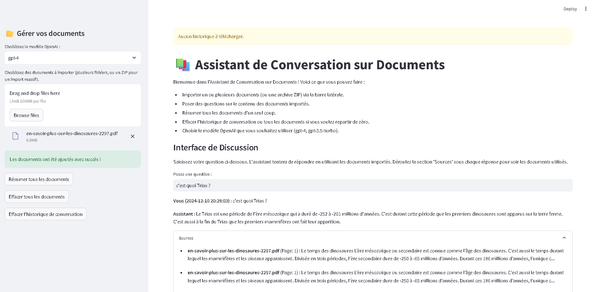

# 📚 Document Chat Assistant

[](https://www.python.org/)
[](https://streamlit.io/)
[](https://github.com/hwchase17/langchain)
[](https://platform.openai.com/docs/introduction)

This repository contains a Streamlit-based **Document Chat Assistant**, enabling users to interact with and query content from various uploaded documents. Users can upload multiple text formats (PDF, TXT, CSV, Excel) and even a ZIP archive containing multiple documents. The application leverages [LangChain](https://github.com/hwchase17/langchain), [langchain-community](https://github.com/hwchase17/langchain) extensions, [langchain-openai](https://github.com/hwchase17/langchain-openai), and OpenAI embeddings and chat models to provide semantic search and Q&A functionalities over the uploaded documents.

**Key Features:**
- **Document Upload:** Upload multiple documents or a ZIP file containing many files.
- **Semantic Search & Q&A:** Ask questions in natural language; get contextually relevant answers sourced from your documents.
- **Summarization:** Generate a global summary of all uploaded documents.
- **Metadata Awareness:** Display metadata (e.g., PDF page numbers, CSV row counts) for each source reference.
- **Model Selection:** Switch between OpenAI models (e.g., `gpt-4`, `gpt-3.5-turbo`).
- **History Management:** Clear conversation history, clear all documents, and download your chat history.

**Language Interface:**  
The UI and messages are presented in French.



---

## Installation
Clone the repository and navigate to the project directory:

```bash
git clone https://github.com/sanlamamba/Document-Talk.git
cd Document-Talk
```


Make sure you have Python 3.11+ installed. We recommend using a virtual environment:

```bash
python3.11 -m rag_talk rag_talk
source rag_talk/bin/activate
```
if you are using conda you can create a new environment using the following command

```bash
conda create -n rag_talk python=3.11
conda activate rag_talk
```

Install the required dependencies from `requirements.txt`:

```bash
pip install --upgrade pip
pip install -r requirements.txt
```

**Required Packages:**
- `streamlit>=1.14.0`
- `langchain>=0.0.9`
- `langchain-community==0.3.18`
- `langchain-openai==0.3.6`
- `openai==1.63.2`
- `pandas==2.2.3`
- `PyPDF2==3.0.1`

### Export your OPEN AI Key in the environment
Get your OpenAI API Key, You can obtain an openAI key :
 -> (Open AI Api Keys)[https://platform.openai.com/api-keys]

If you wish to learn more about Open AI API keys you can read more about it here : (Open AI Quickstart)[https://platform.openai.com/docs/quickstart]

Set your OpenAI API key as an environment variable:
```bash
export OPENAI_API_KEY="sk-..."
```

---

## How to Run

Once all dependencies are installed and `OPENAI_API_KEY` is set, run:

```bash
streamlit run app.py
```

You should see output similar to:

```
You can now view your Streamlit app in your browser.

  Local URL: http://localhost:8501
  Network URL: http://<your_machine_ip>:8501
```

Open the URL in your browser to access the Document Chat Assistant interface.

---

## Usage

1. **Upload Documents:**  
   In the sidebar, upload one or multiple files (PDF, TXT, CSV, Excel) or a ZIP file containing multiple documents.

2. **Ask Questions:**  
   Type your questions in the main interface. The assistant will respond with an answer and provide a list of source documents (with metadata and excerpts) used to generate the response.

3. **Summarize Documents:**  
   Use the "Résumer tous les documents" button in the sidebar to get a global summary.

4. **Manage Documents & History:**  
   - Clear all uploaded documents using the "Effacer tous les documents" button in the sidebar (you will need to refresh the page afterward).
   - Clear chat history using the "Effacer l'historique de conversation" button in the sidebar.
   - Download your chat history for record-keeping.

---

## Model Selection

Use the dropdown in the sidebar to choose between `gpt-4` and `gpt-3.5-turbo`. This selection affects the LLM used for Q&A and summarization.

---

## Notes

- The application is in French, but can handle documents in various languages.
- Ensure your OpenAI API key has appropriate billing and model access.
- If you encounter version warnings or deprecation warnings, consider upgrading the respective libraries.

---

## License

This project is provided under an MIT License. See [LICENSE](LICENSE) for details.

